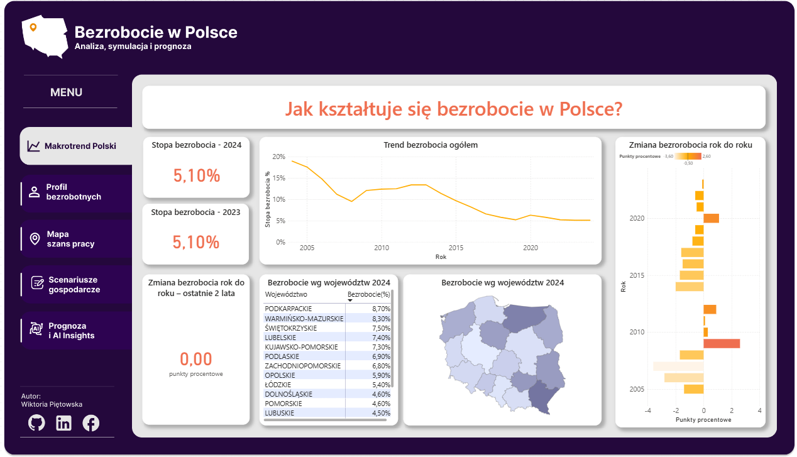
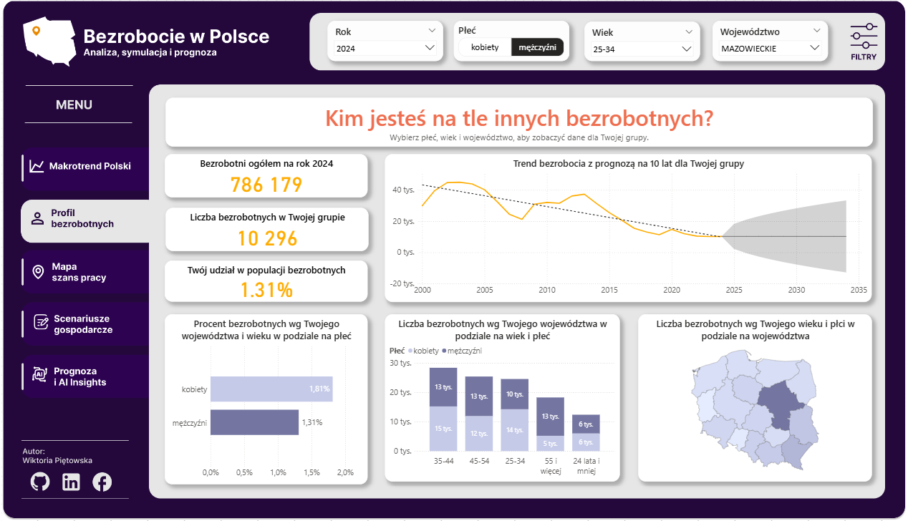
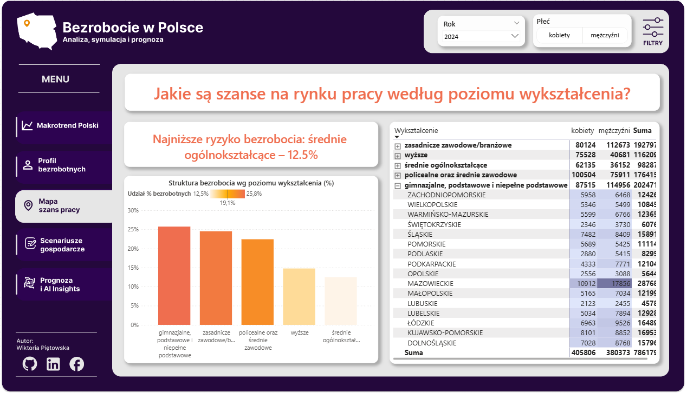
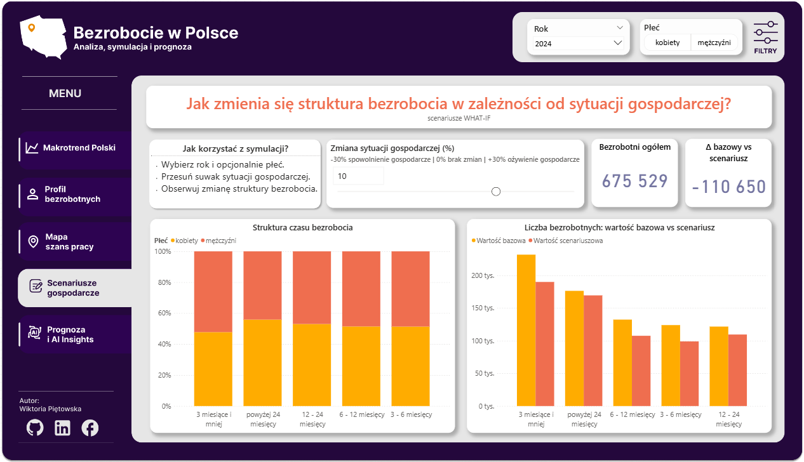
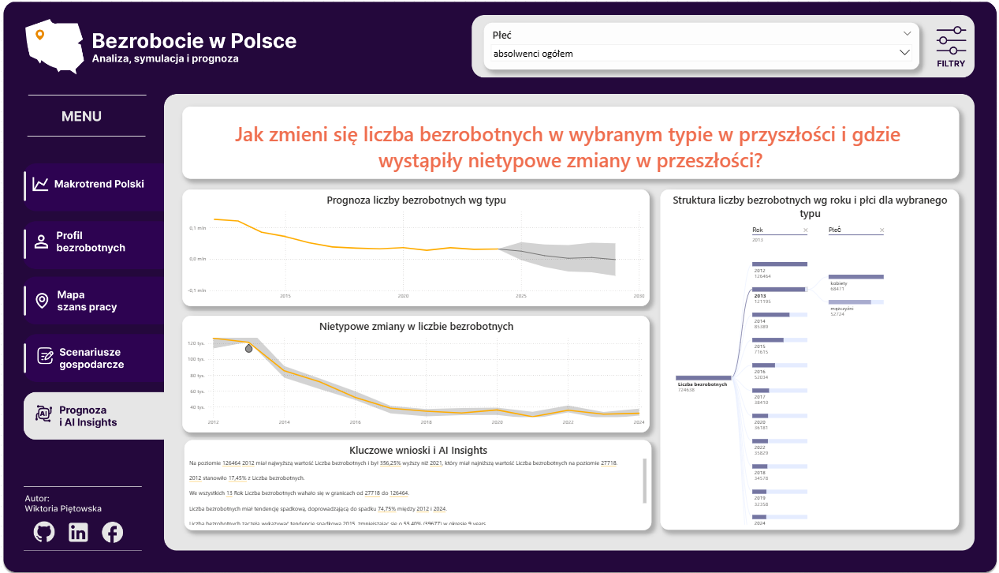

<h2 style="text-align: center;">Bezrobocie w Polsce</h2>

<h3 style="text-align: center;">Co zawiera raport?</h3>
Raport zawiera 5 zakładek znajdujących się w menu po lewej stronie raportu: „Makrotrend Polski”,
„Profil bezrobotnych”, „Mapa szans pracy”, „Scenariusze gospodarcze”, „Prognoza i AI Insights”.

<h3 style="text-align: center;">Jak powstał raport? - Pobieranie danych z GUS za pomocą API</h3>
W raporcie celowo i świadomie nie zastosowałam schematu „gwiazdy” ani centralnej tabeli faktów, ponieważ dane są zbyt zagregowane, by można je było sensownie połączyć. Użyłam modelu rozproszonego, gdzie nie ma relacji między tabelami.  Każda tabela stanowi osobne źródło danych i odpowiada jednej stronie raportu, co zapewnia przejrzystość oraz czytelność wizualizacji.   

Zweryfikowałam plan/szkic mojego raportu i rozważyłam, które dane z podkategorii pobrać. 
Listę zawężyłam do danych z: 
•	Bezrobotni zarejestrowani wg poziomu wykształcenia i płci  
•	Bezrobotni zarejestrowani wg wieku i płci 
•	Bezrobotni zarejestrowani wg czasu pozostawania bez pracy i płci 
•	Bezrobotni zarejestrowani wg płci i typu 
•	Stopa bezrobocia  

Utworzyłam funkcję w języku M, która jako parametr wejściowy przyjmuje parametr subject_id, czyli unikalny kod podkategorii bezrobocia rejestrowanego w Polsce. Zamiast dla każdej tabeli pisać osobny kod, wywołałam wielokrotnie funkcję, w celu pobrania różnych danych z GUS. Miałam na uwadze, że BDL API ogranicza wyświetlanie danych tylko do 10 pozycji, co musiałam obsłużyć w kodzie. Jak również to, że w kolumnie „name” jest zbiór różnych danych geograficznych takich jak: kraj, województwa, regiony, powiaty itp. Mając je w jednej kolumnie podczas wizualizacji mogą pojawić się błędy. Utworzyłam zatem hierarchię poprzez dodanie kolumny wyliczeniowej, którą nazwałam „Poziom”. Na podstawie tej kolumny dodałam w tabeli nowe kolumny: Kraj, Makroregion, Województwo itp. Dzięki tym kolumnom utworzyłam w dalszych krokach hierarchię geograficzną. Nie mogłam również pobrać wszystkich wartości z agregacji, czyli np. dla płci pobrałam wartości „mężczyźni” i „kobiety” ale pominęłam „ogółem”, aby uniknąć błędów w wyliczeniach. Analogicznie dla pozostałych. Jedynie tabela „Stopa bezrobocia” została napisana za pomocą innego języka M, ponieważ potrzebowałam innej prezentacji danych.  

Wywołanie tej funkcji z różnymi parametrami (np. „= fxGetGUS("P1364")”) spowodowało pobranie danych z GUS dla poszczególnych tabel. Na końcu pobieram tabelę „Stopa bezrobocia” poprzez osobny kod, gdyż tabela jest nieco inaczej zbudowana.  

Dodatkowo utworzyłam dwie puste tabele: 
•	#Miary - do przechowywania miar obliczeniowych 
•	#MiaryTytuly - do przechowywania dynamicznych tytułów wykresów 

<h3 style="text-align: center;">Odbiorca raportu</h3>
Raport został przygotowany z myślą o osobach analizujących dane rynku pracy, w szczególności rekruterach, analitykach danych oraz osobach decyzyjnych zainteresowanych ogólnymi trendami bezrobocia w Polsce.
Dashboard umożliwia zarówno szybki przegląd kluczowych wskaźników makroekonomicznych (poziom i zmiany bezrobocia), jak i eksplorację danych dla wybranych grup demograficznych na poziomie województw.

<h3 style="text-align: center;">Przygotowanie stron raportu</h3>
Szablony dla poszczególnych stron raportu powstały w Figmie. 
1.	Pierwsza strona raportu „Makrotrend Polski”. Pokazuje ogólne bezrobocie w Polsce na ostatni dostępny w źródle danych rok. Korzysta z tabeli „Stopa bezrobocia”. 
Na stronie znajdują się: 
•	3x KPI („Aktualna stopa bezrobocia” - w GUS jest to zwykle obecny rok-1, czyli na dzień tworzenia raportu w 2025 roku ostatnią datą był rok 2024; „Zeszłoroczna stopa bezrobocia”; „Porównanie rok do roku za ostatnie 2 lata”); 
•	wykres liniowy - trend bezrobocia ogółem w Polsce; 
•	wykres kolumnowy - bezrobocie rok do roku; 
•	mapa i macierz - aktualne bezrobocie wg województw; 
Mapa zasilana jest plikiem topoJSON, która wyznacza granice województw w Polsce. 
Niektóre z tytułów zasilane są dynamicznym tekstem z DAX, by wskazać , którego roku dotyczy wizualizacja. 
2.	Druga strona raportu „Profil bezrobotnych” 
Odpowiada na pytanie „Kim jesteś na tle innych?”.  Korzysta z tabeli „Bezrobotni wg płci i wieku”. Dzięki tej stronie możemy zweryfikować jak kształtuje się bezrobocie dla grupy, w której się znajdujemy.
Na stronie znajdują się takie wizualizacje jak: 
•	3x KPI: „Bezrobotni ogółem” na ostatni dostępny w źródle danych rok.; „Liczba bezrobotnych w Twojej grupie” - czyli na podstawie wskazanych parametrów, takich jak: wiek, płeć, województwo raport oblicza ile jest osób w Twojej grupie; „Twój udział w populacji bezrobotnych” - na podstawie dwóch poprzednich KPI oblicza jaki procent stanowi grupa, w której jesteś na tle wszystkich bezrobotnych; 
•	Wykres liniowy  „Trend bezrobocia z prognozą na 10 lat Twojej grupy” - jedyna wizualizacja na tej stronie, która nie odnosi się do roku wybranego w filtrach, ponieważ jak nazwa wskazuje jest to trend na przestrzeni wszystkich dostępnych w źródle danych lat; 
•	Wykres kolumnowy „Procent bezrobotnych wg Twojego województwa i wieku w podziale na płeć” - nie reaguje na filtr „Płeć”, ponieważ jest rozbicie na dwie płcie; 
•	Wykres kolumnowy „Liczba bezrobotnych wg Twojego województwa w podziale na wiek i płeć” - również ograniczenie do poszczególnych filtrów; 
•	Mapa - zasilana jak poprzednio.  

3.	Trzecia strona raportu „Mapa szans pracy” 
Odpowiada na pytanie „Jakie są szanse na rynku pracy według poziomu wykształcenia?”. Korzysta z tabeli „Bezrobocie wg wykształcenia i płci”. Dopełnia poprzednie strony raportu poprzez informację w jakim województwie i z jakim wykształceniem są najmniejsze szanse na pozostanie bezrobotnym. 

Na stronie znajdują się: 
•	Wyliczana DAXem informacja, z jakim wykształceniem jest najniższe ryzyko dla wybranych filtrów; 
•	Wykres kolumnowy „Struktura bezrobocia wg poziomu wykształcenia (%)” ; 
•	Macierz z informacjami jak wygląda bezrobocie wg wykształcenia dla poszczególnego województwa z wyróżnieniem największych wartości;  

4.	Czwarta strona raportu „Scenariusze gospodarcze” 
Odpowiada na pytanie „Jak zmienia się struktura bezrobocia w zależności od sytuacji gospodarczej?”. Korzysta z tabeli „Bezrobocie wg czasu pozostawania bez pracy”. Korzysta z wyliczanego parametru what-if, czyli „co by było gdyby…”,  który pozwala na symulację różnych scenariuszy gospodarczych.  

Opis parametru WHAT-IF: „Zmiana sytuacji gospodarczej (%)” 
Cel parametru 
Parametr „Zmiana sytuacji gospodarczej (%)” umożliwia symulację wpływu ożywienia lub spowolnienia gospodarczego na strukturę bezrobocia według czasu pozostawania bez pracy, w oparciu o empiryczne reakcje zaobserwowane w danych GUS.Parametr nie prognozuje przyszłych wartości, lecz pozwala analizować jak zmienia się struktura bezrobocia, gdy warunki gospodarcze ulegają poprawie lub pogorszeniu. 
________________________________________ 
Założenia analityczne  
•	Rok bazowy: 2009  
Rok 2009 został przyjęty jako punkt odniesienia, reprezentujący sytuację wyjściową rynku pracy. 
•	Rok porównawczy (kryzysowy): 2020 
Rok 2020 został wykorzystany jako obserwacja okresu silnego szoku gospodarczego. 
Na podstawie tych dwóch lat wyznaczono empiryczne wagi reakcji poszczególnych grup bezrobotnych. 
________________________________________ 
Logika działania parametru 
1.	Udziały bazowe (2009) 
Rok bazowy (po kryzysie 2008 r., stabilniejsza sytuacja wyjściowa do analiz). Dla każdej kategorii czasu pozostawania bez pracy obliczono jej udział w całkowitej liczbie bezrobotnych w roku 2009.  
2.	Udziały kryzysowe (2020) 
Rok kryzysowy (pandemia COVID-19, duże zakłócenia na rynku pracy). Analogicznie obliczono udziały tych samych kategorii w roku 2020. 
3.	Waga empiryczna reakcji 
Dla każdej kategorii wyznaczono wagę jako: 
waga = udział w roku bazowym – udział w roku kryzysowym 
Waga opisuje historyczną wrażliwość danej grupy na pogorszenie koniunktury. 
4.	Parametr WHAT-IF 
Suwak przyjmuje wartości dodatnie i ujemne: 
o	wartości dodatnie → ożywienie gospodarcze 
o	wartości ujemne → spowolnienie / kryzys 
Parametr skaluje empiryczną wagę reakcji. 
5.	Przeliczenie scenariusza 
Liczba bezrobotnych w scenariuszu jest liczona jako: 
całkowite bezrobocie w roku 2009 × (udział kategorii w 2009 + parametr × waga empiryczna)
________________________________________ 
Interpretacja suwaka 
Wartość	Znaczenie 
0%	Brak zmian względem struktury z 2009 r. 
+10%	Ożywienie gospodarcze – spadek bezrobocia 
+20%	Silne ożywienie – najsilniej reagujące grupy szybciej opuszczają bezrobocie 
–10%	Spowolnienie gospodarcze 
–20%	Kryzys – wzrost udziału grup najbardziej wrażliwych 
________________________________________ 
Co umożliwia ta analiza 
•	identyfikację grup najbardziej wrażliwych na zmiany koniunktury 
•	analizę zmian strukturalnych bezrobocia, a nie tylko jego poziomu 
•	symulację scenariuszy dla potrzeb analiz rynku pracy i polityki publicznej 
________________________________________ 
Zastrzeżenie interpretacyjne 
Parametr WHAT-IF ma charakter scenariuszowy. 
Nie jest prognozą statystyczną, lecz narzędziem analitycznym opartym na historycznych reakcjach struktury bezrobocia.  

Na stronie znajdują się: 
•	parametr what-IF; informacja jak z niego korzystać; 
•	2xKPI: „Bezrobotni ogółem”; „Delta scenariusza bazowego vs scenariusz z wyliczeniem what-if”; 
•	100% Skumulowany wykres kolumnowy „Struktura czasu bezrobocia”; 
•	Wykres kolumnowy „Liczba bezrobotnych: wartość bazowa vs scenariusz”  

1.  Piąta strona raportu „Prognoza i AI Insights” 
Odpowiada na kilka pytań: „Jak zmieni się liczba bezrobotnych w wybranym typie i gdzie wystąpiły nietypowe zmiany w przeszłości?”. Korzysta z tabeli „Bezrobotni wg płci i typu”. Korzysta z wbudowanych wizualizacji wspieranych przez AI. 
Na stronie znajdują się: 
•	Wykres liniowy z prognozą „Prognoza liczby bezrobotnych wg typu”; 
•	Wykres liniowy z zaznaczeniem anomalii „Nietypowe zmiany w liczbie bezrobotnych”; 
•	Okno AI „Kluczowe wnioski i insighty AI” - automatycznie podsumowanie strony przez AI; 
•	Drzewo dekompozycji „Struktura liczby bezrobotnych wg roku i płci dla wybranego typu”;  

Strony zawierają wysuwane filtry, które w każdej chwili można schować, jeśli użytkownik potrzebuje zaprezentować dane tylko z jakiegoś zakresu. Każda strona ma również interaktywne przyciski przenoszące na inne strony oraz do mojego portfolio na GitHub lub profilu na Linkedin. 

<h3 style="text-align: center;">Przykładowe wnioski z raportu</h3>
•	Trend bezrobocia jest malejący z każdym kolejnym rokiem; 
•	Największy % bezrobocia w 2024 roku był w województwie podkarpackim oraz warmińsko-mazurskim; 
•	Bezrobocie na przestrzeni ostatnich dwóch lat utrzymuje się na podobnym poziomie - 5,10%; 
•	W 2024 roku największy % bezrobotnych był w przedziale wiekowym 34-44 lata i większą grupą były kobiety; 
•	Największe ryzyko bezrobocia dotyczy z osób z wykształceniem gimnazjalnym/podstawowym; 
•	Ożywienie gospodarcze spowodowałoby spadek liczby bezrobotnych natomiast spowolnienie wzrost tej liczby; 

    
<h3>WIZUALIZACJA RAPORTU</h3>

1. Strona pierwsza raportu
   

2. Strona druga raportu z otwartymi filtrami
   

3. Strona trzecia raportu z otwartymi filtrami
   

4. Strona czwarta raportu z otwartymi filtrami
   

5. Strona piąta raportu z otwartymi filtrami
  
 

