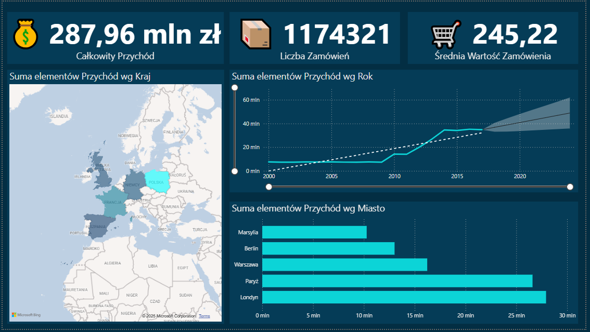
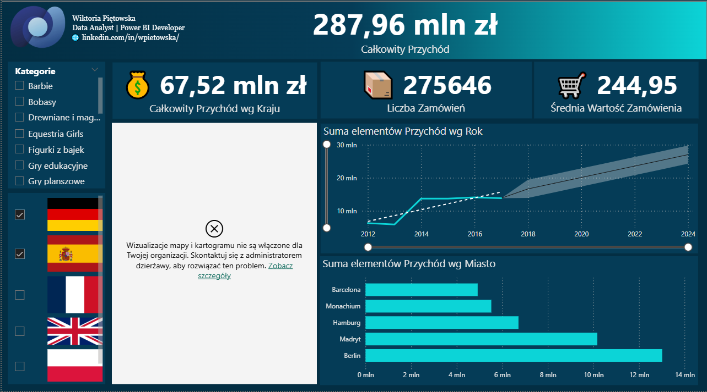
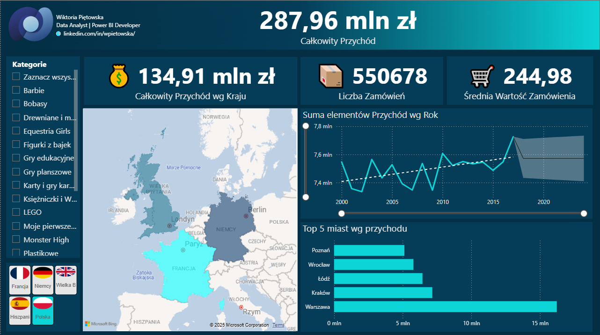
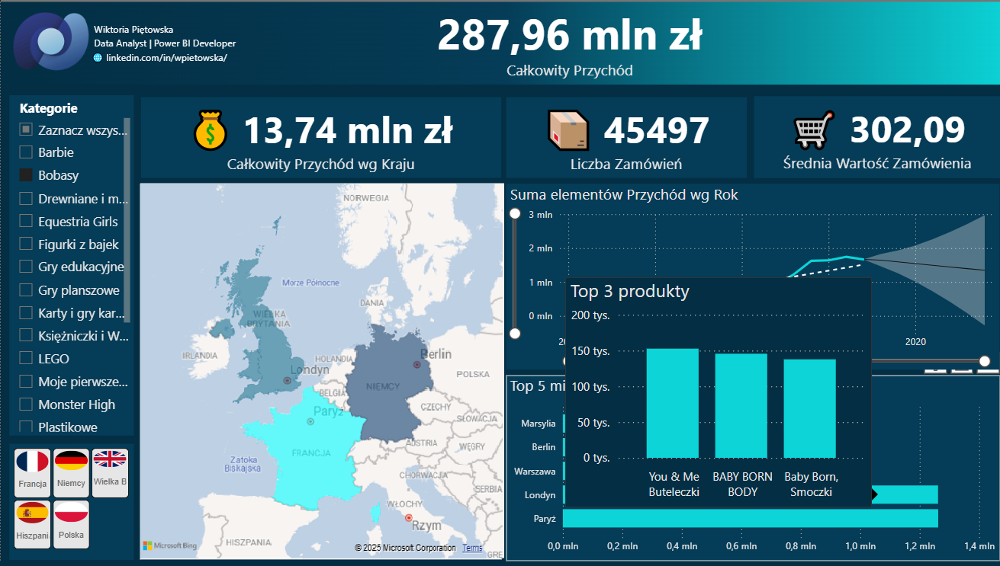

<h2 style="text-align: center;">Raport porównania sprzedaży w różnych krajach</h2>

**Co zawiera raport?**

KPI: całkowity przychód, całkowity przychód wg kraju, liczba transakcji, średnia wartość zamówienia.

Wizualizacje: mapa z podziałem na kraje, wykres słupkowy „Top 5 miast” w każdym kraju, trend sprzedaży w czasie.

Dodatkowe efekty: **mapa interaktywna** + **dynamiczne filtrowanie** po kraju.

**Jak powstał raport?**

**Krok 1 – Połączenie i przekształcanie danych**

1. **Pobieram dane** do Power BI za pomocą funkcji „Pobierz dane” -> Skoroszyt programu Excel i wybieram plik **xlsx** ZabawkiTabele z 4 arkuszami: Produkty, Sprzedaż, Kalendarz, RelacjeKraje.
2. Ponieważ arkusze jak i tabele w Excelu nazywały się tak samo Power BI automatycznie dodał do nich cyfry, aby je lepiej rozróżnić. Usuwam dodatkowe cyfry. Zmiana np. z Kalendarz1 na Kalendarz.
3. **Pobieram dane z folderu** SprzedażZagraniczna w formacie **csv**. Ponieważ mamy 4 pliki z różnymi wielkościami rozszerzenia (.cvs, .CSV, .Csv) ujednolicamy je na jeden spójny format .csv za pomocą Przekształć -> małe litery. PowerBI jest wrażliwy na wielkość liter, dodatkowo plik z innym rozszerzeniem może powodować błędy przy łączeniu.
4. Używam polecenia **„Połącz pliki”**, aby połączyć 4 pliki w jedną tabelę.
5. Zmieniam typ danych w kolumnie Kod pocztowy w tabeli SprzedażZagraniczna z typu liczbowego na typ tekstowy, ponieważ w niektórych krajach kod pocztowy nie składa się z samych cyfr.
6. Dane z tabeli SprzedażZagraniczna **dołączam** do tabeli Sprzedaż używając polecenia „**Dołącz zapytania”**. Tabele muszą mieć te same nazwy kolumn włącznie z wielkością liter. W tabeli Sprzedaż brakuje kolumny Kraj, więc przed dołączeniem dodałam nową kolumnę Kraj typu tekstowego z wartościami „Polska”.

👉 Efekt: jedna tabela o nazwie np. **SprzedażZagraniczna** ze wszystkimi krajami.

1. Ponieważ dane z tabeli SprzedażZagraniczna mamy już w tabeli Sprzedaż odznaczam opcję „Włącz ładowanie”, aby nie zaczytywać tych danych do Power BI.
2. Aby łatwiej było mi się poruszać w Power Query tworzę grupę „Sprzedażowe”, gdzie umieszczam tabele Sprzedaż i SprzedażZagraniczna.
3. Tworzę nową tabelę Państwa za pomocą funkcji „Wprowadź dane”, gdzie przechowuję nazwę kraju oraz adres url do obrazka flagi, które wykorzystam do slicera.

**Krok 2 – Modelowanie danych w Power BI Desktop**

1. Tworzę relacje i ukrywam kolumny z ID.
2. Usuwam automatyczne sumowanie dla takich kolumn jak np. Rok, NrMiesiąca.
3. W narzędziach kolumn dla tabeli Kalendarz i kolumny NazwaMiesiąca ustawiam sortowanie według kolumny NrMiesiąca.
4. Zmieniam format daty we wszystkich tabelach na yyyy-mm-dd.
5. Tworzę nową pustą tabelę #Miary do przechowywania miar.

**Krok 3 – Proste miary z emoji (DAX)**

1. Utworzenie tabeli #Miary do przetrzymywania miar.
2. Całkowity Przychód = FORMAT (CALCULATE(

&nbsp;   SUM ( 'Sprzedaż'\[Przychód\]),

&nbsp;   ALL('Sprzedaż'))

&nbsp;   , "0,,.00 mln zł" )

1. Całkowity Przychód wg Kraju = "💰 " & FORMAT (SUM ( 'Sprzedaż'\[Przychód\]), "0,,.00 mln zł" )
2. Liczba Zamówień = "📦 " & COUNTROWS ( 'Sprzedaż' )

Średnia Wartość Zamówienia = "🛒 " & FORMAT (

&nbsp;   DIVIDE ( SUM ( 'Sprzedaż'\[Przychód\]), COUNTROWS ( 'Sprzedaż' ) )

&nbsp;   , "0.00")

1. Średnia Wartość Zamówienia = "🛒 " & FORMAT (

&nbsp;   DIVIDE ( SUM ( 'Sprzedaż'\[Przychód\]), COUNTROWS ( 'Sprzedaż' ) )

&nbsp;   , "0.00")

**Krok 4 – Dodanie wizualizacji na stronie startowej**

1. Mapa → sprzedaż wg Kraj (rozmiar bąbla = Przychód).
2. KPI Card → Całkowity Przychód, wg Kraju, Całkowity Przychód Liczba Zamówień, Średnia wartość.
3. Wykres słupkowy → Top 5 miast wg przychodu.
    1. Oś: Miasto, Wartość: Całkowity Przychód.
    2. Filtr: „Top N = 5”.
4. Wykres liniowy → Trend sprzedaży (Data na osi, Przychód jako wartość).

**Krok 5 – Dodanie slicerów i logo z danymi**

1. Dodaję fragmentator kategorii produktów z opcją „Zaznacz wszystko”.
2. Pobieram nowy fragmentator „ChicletSlicer” i buduję filtr z flagami Państw.4
3. Dodanie logo i danych osobowych oraz linku, który przekierowuje do profilu na linkedin.

**Krok 6 – Dodanie tooltip z wykresem**

1. Utworzenie nowej strony raportu Tooltip_Top3_Produlty
2. Utworzenie wykresu z Top 3 produkty i zezwolenie na użycie strony jako etykiety narzędzia
3. Powrót do raportu głównego i dodanie tooltipa do wykresu słupkowego w Etykiety -> Typ = Strona raportu, Strona = Tooltip_Top3_Produkty.

**ETAPY POWSTAWANIA RAPORTU**

1. 
2. 
3. 
4. 
   
   